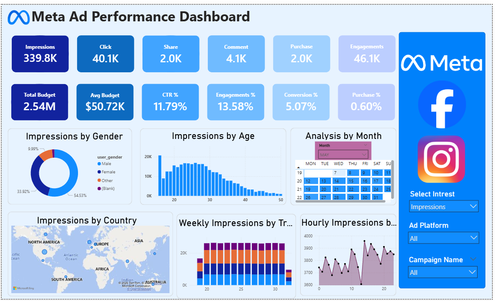
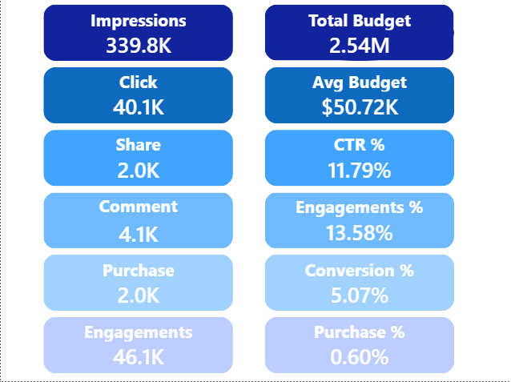

Meta Ad Performance Analysis-PowerBI

📌 Project Overview

Developed an interactive advertising analytics dashboard using Microsoft Power BI to analyze campaign performance data from Meta Platforms.

The dashboard tracks key metrics such as impressions, clicks, engagement, conversions, and budget utilization to evaluate advertising effectiveness.

The report provides insights into audience behavior, campaign performance, and time-based engagement patterns to support data-driven marketing decisions.

🎯 Business Objectives

1.CBuilt an interactive dashboard in Power BI to analyze ad campaign performance

2.Created KPIs for impressions, clicks, CTR, engagement, and conversion rates

3.Analyzed performance by age, gender, country, and time trends

4.Developed DAX measures for marketing metrics

5.Added interactive filters and calendar tooltips for daily insights.

📊 Key Performance Indicators (KPIs)

1.Impressions: 339.8K

2.Clicks: 40.1K

3.Shares: 2.0K

4.Comments: 4.1K

5.Purchases (Conversions): 2.0K

6.Engagements: 46.1K

7.CTR (Click-Through Rate): 11.79%

8.Engagement Rate: 13.58%

9.Conversion Rate: 5.21% 

10.Purchase Rate: 0.61%:

11.Total Budget: 2.5M 

11.Avg Budget per Campaign: 50.7K

📈 Dashboard Features

1.KPI summary cards for performance tracking

2.Demographic analysis (Age & Gender)

3.Geographic analysis by country

4.Monthly, weekly, and hourly trends

5.Campaign performance analysis

6.Interactive filters

7.Custom tooltip pages for daily insights

🛠 Tools & Technologies Used

Power BI Desktop – Dashboard development

MySQL – Data storage and queries

SQL – Data extraction and transformation

DAX – Calculated measures and KPIs

Power Query – Data cleaning and transformation

Parameters – Dynamic filtering

📂 Project Structure

Meta Ad Performance Analysis
│
├── Raw_Data/        # Original dataset

├── PowerBI/         # Power BI (.pbix) file

├── Images/          # Dashboard screenshots

├── README.md        # Project documentation

└── REPORT.md        # Analysis report

🚀 Skills Demonstrated

Data Modeling in Power BI

1.DAX Calculations

2.KPI Development

3.Data Visualization

4.SQL Integration

5.Dashboard Design

6.Marketing Analytics

7.Interactive Reporting

📷 Dashboard Preview

### Overview Dashboard

### Tooltip View

